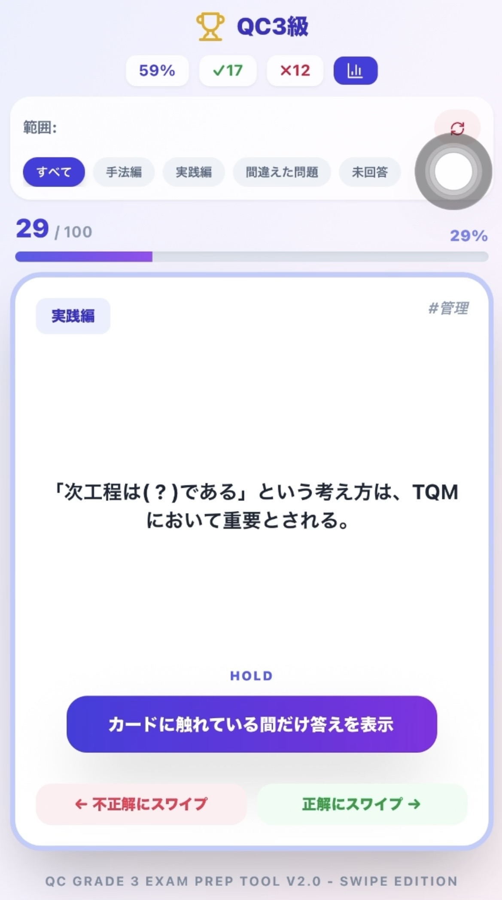

# swipe-quiz-format

アプリ名 + 問題JSONで、スワイプ式クイズUIをそのまま使える React ライブラリです。

## サンプル画面

<p align="center">
  
  
  
</p>

## 目的

- 問題データだけ差し替えて同等UXの学習アプリを作る
- 正誤記録、間違えた問題フィルタ、未回答フィルタ、統計表示を標準搭載
- モバイル向けの「触れている間だけ答え表示 + スワイプ判定」を標準搭載

## インストール

### GitHub 経由（このディレクトリを単独リポジトリ化した場合）

```bash
npm i github:<owner>/<repo>
```

### 通常 npm 公開後

```bash
npm i swipe-quiz-format
```

## 利用条件

- React 18+
- Tailwind CSS 環境（このUIは Tailwind クラスで構成）
- `content` にライブラリパスを含めること

例: `tailwind.config.js`

```js
export default {
  content: [
    './index.html',
    './src/**/*.{js,ts,jsx,tsx}',
    './node_modules/swipe-quiz-format/dist/**/*.{js,mjs,cjs}'
  ]
}
```

## 使い方

```tsx
import { SwipeQuiz } from 'swipe-quiz-format';

const questions = [
  {
    id: 1,
    category: '基礎',
    sub: '定義',
    question: '品質管理の基本サイクルは？',
    answer: 'PDCA'
  }
];

export default function App() {
  return (
    <SwipeQuiz
      appName="QC3級"
      questions={questions}
      storageKey="qc3-progress"
      showFooter={false}
      enableShuffle
      showStatsButton
      swipeThreshold={90}
      autoNextDelayMs={250}
      onAnswer={(e) => console.log(e.question.id, e.isCorrect)}
    />
  );
}
```

### 既存 JSON（`q` / `a`）もそのまま利用可能

```ts
const questions = [
  { id: 1, category: '基礎', sub: 'QC7', q: 'パレート図とは？', a: '重点指向の図' }
];
```

## Props

- `appName`: 画面上部タイトル
- `questions`: 問題配列（`question/answer` 形式 or `q/a` 形式）
- `storageKey?`: LocalStorageキー（デフォルト: `swipe-quiz-progress`）
- `showFooter?`: フッター表示（デフォルト: `true`）
- `footerText?`: フッターテキスト
- `labels?`: 文言の上書き（i18n向け）
- `showStatsButton?`: 統計ボタン表示（デフォルト: `true`）
- `enableShuffle?`: シャッフルボタン表示（デフォルト: `true`）
- `swipeThreshold?`: スワイプ判定ピクセル閾値（デフォルト: `100`）
- `autoNextDelayMs?`: 正誤判定後の次問題遷移遅延ms（デフォルト: `280`）
- `onAnswer?`: 回答時イベント
- `onProgressReset?`: 学習履歴リセット完了イベント

### `labels` の例

```tsx
<SwipeQuiz
  appName="My Quiz"
  questions={questions}
  labels={{
    all: 'All',
    incorrectOnly: 'Wrong only',
    unansweredOnly: 'Not answered',
    correct: 'Correct',
    incorrect: 'Wrong'
  }}
/>
```

## ビルド

```bash
npm run build
```
